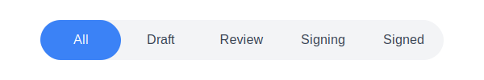

# Segmented Control Component for React

A beautiful, animated segmented control component for React applications built with Next.js, TypeScript, and Tailwind CSS.



## Features

- Smooth animations using Framer Motion
- Fully customizable with Tailwind CSS
- Responsive design
- TypeScript support
- Accessible (keyboard navigation and screen reader support)
- Easy to integrate into any React project

## Installation

```bash
npm install
# or
yarn
# or
pnpm install
# or
bun install
```

## Usage

```tsx
import { SegmentedControl } from "@/components/ui/segmented-control";

export default function MyComponent() {
  const handleTabChange = (tab: string) => {
    console.log(`Selected tab: ${tab}`);
  };

  return (
    <SegmentedControl 
      tabs={["All", "Draft", "Review", "Signing", "Signed"]} 
      defaultTab="All"
      onChange={handleTabChange}
    />
  );
}
```

## Props

| Prop | Type | Description | Required |
|------|------|-------------|----------|
| tabs | string[] | Array of tab names to display | Yes |
| defaultTab | string | The initially selected tab | No |
| onChange | (tab: string) => void | Callback function when tab changes | No |

## Development

First, run the development server:

```bash
npm run dev
# or
yarn dev
# or
pnpm dev
# or
bun dev
```

Open [http://localhost:3000](http://localhost:3000) with your browser to see the result.

## License

MIT

## Credits

Built with:
- [Next.js](https://nextjs.org/)
- [TypeScript](https://www.typescriptlang.org/)
- [Tailwind CSS](https://tailwindcss.com/)
- [Framer Motion](https://www.framer.com/motion/)
